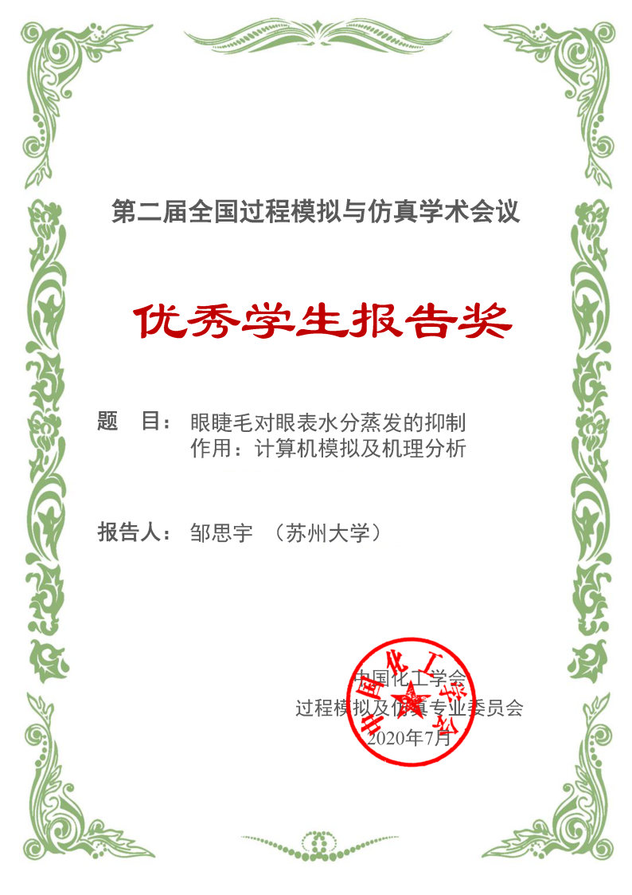

# Siyu Zou (邹思宇)

Hello, my name is Siyu Zou, in Chinese "邹思宇". I am currently a Postdoctoral Research Fellow at Soochow University.

Address: College of Chemistry, Chemical Engineering and Materials Science, Soochow University, Suzhou, Jiangsu Province, China

Email: `syzou [at] suda [dot] edu [dot] cn` or `zousiyu1995 [at] outlook [dot] com`

## PERSONAL INFORMATION

I received my **Ph.D.** degree (Sep. 2016 - Jun. 2021) in **Applied Chemistry** from [Soochow University](https://chemistry.suda.edu.cn/) (Suzhou, China). But, I majored in **Chemical Engineering**. My advisors were Prof. [Xiao Dong Chen](https://scholar.google.com/citations?user=fg3sXKwAAAAJ&hl=zh-CN) and Prof. [Jie Xiao](https://web.suda.edu.cn/jie.xiao/). During My Ph.D. I focused on modeling and simulation of reactors with porous structures.

My main research interests are in **mathematical modeling** and **numerical simulation** of transport phenomena (fluid dynamics, mass and heat transfer, and reaction kinetics) in nature and industry, including porous media reactors, bio-inspired systems, and enzymatic reaction systems. Typically, I model transport phenomena with computational fluid dynamics (**CFD**) and validate the models with clearly defined experiments. I usually use **ANSYS Fluent** as the preferred solver for CFD and **COMSOL Multiphysics** as the preferred solver for multiphysics coupling problems (mass transfer, heat transfer, etc.) and custom partial or ordinary differential equations (PDE or ODE). Generally, I use **MATLAB** to process simulation results.

I am also an enthusiastic self-learner interested in various fields of computer science. I taught myself some programming languages (e.g., **Python, Rust, C**) and have solved some basic **data structures and algorithms** problems using them (see my [leetcode record](https://github.com/zousiyu1995/leetcode)). I also taught myself the **LaTeX** toolchain to write notes related to mathematics and programming (see my [Github](https://github.com/zousiyu1995)). I have basic knowledge of **Linux** system and **Shell** programming and was once responsible for the daily maintenance of a Linux cluster at Soochow University.

Also find me on [Google Scholar](https://scholar.google.com/citations?user=w6AliuwAAAAJ&hl=zh-CN),  [Research Gate](https://www.researchgate.net/profile/Siyu-Zou-3),  [ORCiD](https://orcid.org/my-orcid?orcid=0000-0002-9152-9844), and [Github](https://github.com/zousiyu1995).

I am an enthusiast of Jazz, Blues, and Chinese folk music. I'm not a fan of a specific artist. I listen to music impromptu, just like Jazz improvisation. Sometimes I do photography.

## AWARDS

- **2020.07, Best Student Presentation Award**: In the 2nd National Conference on Process Modeling and Simulation, My talk on eyelashes ("Inhibition of Ocular Water Evaporation by Eyelashes: Computer Simulation and Mechanism Analysis") was awarded the Best Student Presentation Award (1 of 12 awardees out of 62 student talks). This work has been published in [Journal of the Royal Society Interface](https://royalsocietypublishing.org/doi/10.1098/rsif.2019.0425). This conference was organized by the [Simulation & Virtual Process Engineering Committee](http://www.ciesc.cn/branch/226), one of the professional committees of the [Chemical Industry and Engineering Society of China (CIESC)](http://www.ciesc.cn/).

  

## WORK EXPERIENCES

- **2021.07 - now, Postdoctoral Research Fellow**, [College of Chemistry, Chemical Engineering and Materials Science](https://chemistry.suda.edu.cn/), [Soochow University](https://www.suda.edu.cn/), China. My Postdoc's project is mathematical modeling for a three-phase enzyme electrode. The project aims to investigate the relationship between electrode performance and the structure of the three-phase interface and reveal the underlying mechanisms. (co-advisors: Prof. [Xinjian Feng](https://www.researchgate.net/scientific-contributions/Xinjian-Feng-38952909) and Prof. [Jie Xiao](https://web.suda.edu.cn/jie.xiao/))

## PUBLICATIONS

[Cite them in bibtex format](./bib_my_paper.bib).

`*` denotes the corresponding author.

### MAIN PUBLICATIONS

1. **Siyu Zou**, Dandan Wang, Jie Xiao\*, Xinjian Feng\*. Mathematical Model for a Three-Phase Enzymatic Reaction System. Industrial & Engineering Chemistry Research, 2023, 62 (10), 4337–4343. <https://doi.org/10.1021/acs.iecr.2c04492>.
2. **Siyu Zou**, Jie Xiao\*, Viola Wu, Xiao Dong Chen\*. Analyzing Industrial CVD Reactors Using a Porous Media Approach. Chemical Engineering Journal, 2021, 415, 129038. <https://doi.org/10.1016/j.cej.2021.129038>.
3. **Siyu Zou**, Jinping Zha, Jie Xiao\*, Xiao Dong Chen. How Eyelashes Can Protect the Eye Through Inhibiting Ocular Water Evaporation: A Chemical Engineering Perspective. Journal of the Royal Society Interface, 2019, 16 (159), 20190425. <https://doi.org/10.1098/rsif.2019.0425>.
4. **邹思宇 (Siyu Zou)**, 凌二锁, 乐淑荣, 孙盛鹏, 吴张雄, 陈晓东, 吴铎, 肖杰\*. 臭氧催化氧化反应器模拟与分析. 化工进展, 2019, 38 (9), 3969–3978. <https://doi.org/10.16085/j.issn.1000-6613.2018-2476>. (In Chinese)

### OTHER PUBLICATIONS

1. Kaixin Li, **Siyu Zou**, Jun Zhang\*, Yang Huang, Lin He\*, and Xinjian Feng\*. Superhydrophobicity-Enabled Efficient Electrocatalytic CO₂ Reduction at a High Temperature. ACS Catalysis, 2023, 13 (14), 9346–9351. <https://doi.org/10.1021/acscatal.3c01444>.
2. Xiao Dong Chen\*, **Siyu Zou**. Reaction Engineering Approach to Turbulence Modelling—Universal Law of the Wall, Pipe Flow, and Planar Jet Flow. Journal of Chemical Engineering of Japan, 2021, 54 (1), 1–11. <https://doi.org/10.1252/jcej.20we056>.
3. Jinping Zha, **Siyu Zou**, Jianyu Hao, Xinjuan Liu, Guillaume Delaplace, Romain Jeantet, Didier Dupont, Peng Wu, Xiao Dong Chen, Jie Xiao\*. The Role of Circular Folds in Mixing Intensification in the Small Intestine: A Numerical Study. Chemical Engineering Science, 2021, 229, 116079. <https://doi.org/10.1016/j.ces.2020.116079>.
4. 夏红桃, **邹思宇 (Siyu Zou)**, 肖杰\*. 随机粗糙表面上剪切变稀流体液滴的沉积过程模拟. 化工学报, 2019, 70 (2), 634–645. <https://doi.org/10.11949/j.issn.0438-1157.20181213>. (In Chinese)
5. Jie Xiao\*, Fei Pan, Hongtao Xia, **Siyu Zou**, Hui Zhang, Oluwafemi Ayodele George, Fei Zhou, Yinlun Huang. Computational Study of Single Droplet Deposition on Randomly Rough Surfaces: Surface Morphological Effect on Droplet Impact Dynamics. Industrial & Engineering Chemistry Research, 2018, 57 (22), 7664–7675. <https://doi.org/10.1021/acs.iecr.8b00418>.
