# Siyu Zou (邹思宇)

Siyu Zou (邹思宇) is currently a Lecturer in the School of Chemical Engineering at Xiangtan University.

Address: School of Chemical Engineering, Xiangtan University, Xiangtan, Hunan, China

Email: `siyu [dot] zou [at] xtu [dot] edu [dot] cn` or `zousiyu1995 [at] outlook [dot] com`

Click download my [cv](./cv/cv.pdf).

## Personal Information

I received my Ph.D. degree in Chemical Engineering from [Soochow University](https://chemistry.suda.edu.cn/) (Suzhou, China), under the guidance of Prof. [Xiao Dong Chen](https://scholar.google.com/citations?user=fg3sXKwAAAAJ&hl=zh-CN) and Prof. [Jie Xiao](https://web.suda.edu.cn/jie.xiao/). During My doctoral research, I focused on modeling and simulation of reactors with porous structures.

My main research interests lie in mathematical modeling and numerical simulation of transport phenomena (fluid dynamics, mass and heat transfer, and reaction kinetics) in nature and industry. I leverage chemical engineering principles to develop multi-physics models to understand, design, and optimize these processes. Some examples of application,

- Modeling and design of biosensor, e.g, enzyme electrodes.
- Modeling and optimization of chemical reactors, e.g, fixed bed reactors, CVD reactors.
- Understanding biological systems from chemical engineering perspective, e.g, eyelashes, digestive system, cardiovascular system.

## Employment

- **Since 09/2024, Lecturer**, [School of Chemical Engineering](https://hgxy.xtu.edu.cn/), [Xiangtan University](https://www.xtu.edu.cn/), Xiangtan, Hunan Province, China.
- **07/2021 - 06/2024, Postdoctoral Research Fellow**, [College of Chemistry, Chemical Engineering and Materials Science](https://chemistry.suda.edu.cn/), [Soochow University](https://www.suda.edu.cn/), Jiangsu Province, China. Co-Advisors: Prof. [Xinjian Feng](https://www.researchgate.net/scientific-contributions/Xinjian-Feng-38952909) and Prof. [Jie Xiao](https://web.suda.edu.cn/jie.xiao/). My postdoctoral research focuses on developing a mathematical model for a three-phase enzyme electrode. This project aims to unravel the relationship between electrode performance and the structure of the three-phase interface and reveal the underlying mechanisms.

## Skills

- **Expertise**: Chemical Engineering, Transport Phenomena, Incompressible Flows, Mass Transfer, Heat Transfer, Mathematical Modeling, Numerical Simulation, Multi-Physics Modeling, Computational Fluid Dynamics (CFD), Finite Volume Method (FVM), Turbulence Modeling, Porous Media
- **Software**: Basilisk, OpenFOAM, Blender, LaTeX, Linux, ANSYS Fluent, COMSOL Multiphysics
- **Programming**: Python, C, MATLAB, Algorithms, Data Structures

## Publications

Also find me on [Google Scholar](https://scholar.google.com/citations?user=w6AliuwAAAAJ&hl=zh-CN) and [Research Gate](https://www.researchgate.net/profile/Siyu-Zou-3).

### Main Publications

**[8]** Xiaohang Yang, Jiaxin Zou, Ziyang Chen, Haibo Jiang, Guo Xiong, He'an Luo, **Siyu Zou**\*, Hongyun Yang\*. A Mass Transfer Study on Formaldehyde Oxidation Using Anodic Aluminum Oxide-Based Structured Catalysts. Industrial & Engineering Chemistry Research, 2026. <https://doi.org/10.1021/acs.iecr.6c00749>.

  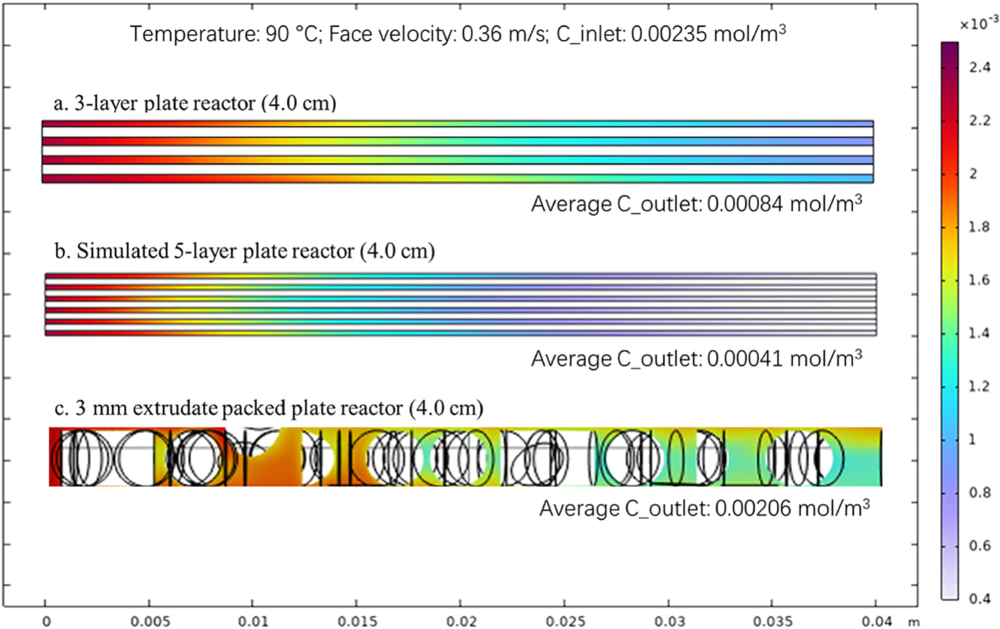

**[7]** **Siyu Zou**, Jie Xiao\*, Xinjian Feng\*. Engineering Enzyme Electrode with 3D Three-Phase Interface to Boost Enzymatic and Electrochemical Cascade Reactions. Chemical Engineering Science, 2025. <https://doi.org/10.1016/j.ces.2025.122189>

  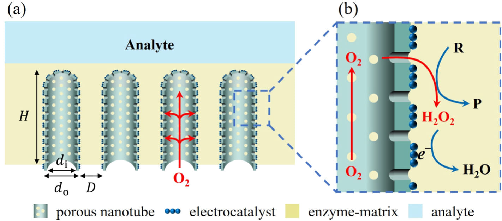

**[6]** **Siyu Zou\***, Jie Xiao, Xiao Dong Chen\*. A Comprehensive Comparison of Different RANS Turbulence Models in Modeling Turbulent Plane Jets. ACS Omega, 2025. <https://doi.org/10.1021/acsomega.5c01448>

  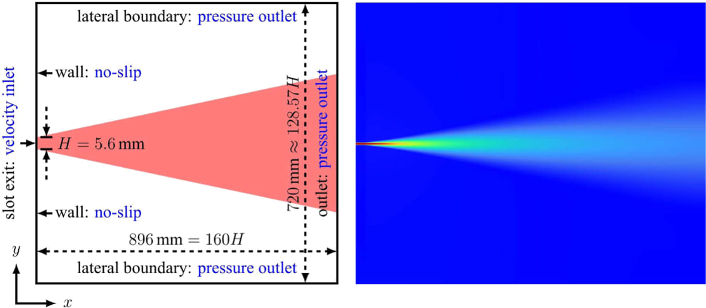

**[5]** **Siyu Zou**, Jie Xiao\*, Xinjian Feng\*. Modeling Enzymatic and Electrochemical Cascade Reactions at the Three-Phase Interface Enzyme Electrode. AIChE Journal, 2024. <https://doi.org/10.1002/aic.18420>

  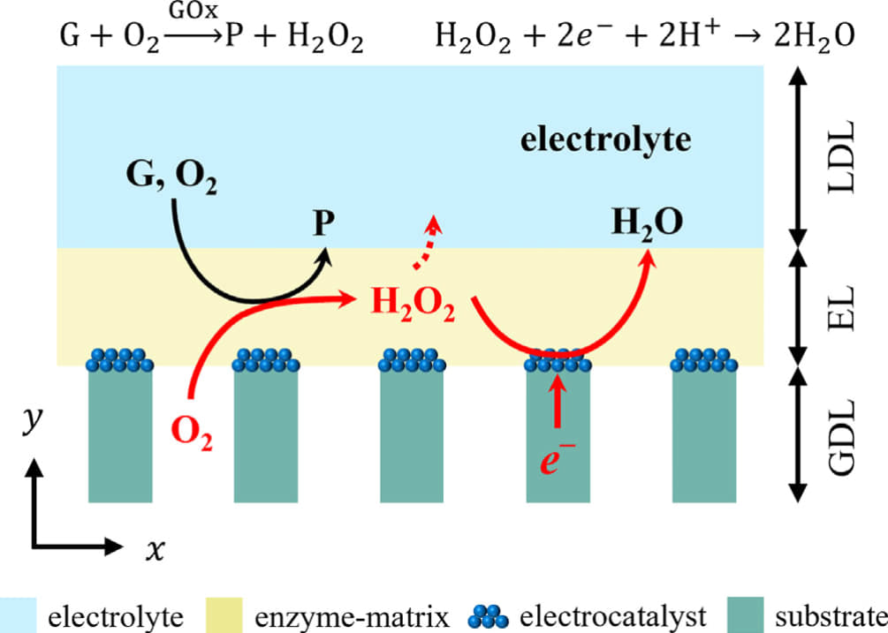

**[4]** **Siyu Zou**, Dandan Wang, Jie Xiao\*, Xinjian Feng\*. Mathematical Model for a Three-Phase Enzymatic Reaction System. Industrial & Engineering Chemistry Research, 2023. <https://doi.org/10.1021/acs.iecr.2c04492>

  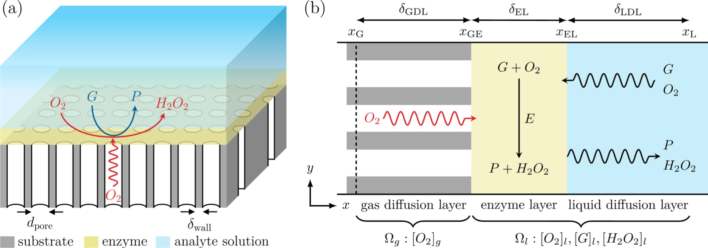

**[3]** **Siyu Zou**, Jie Xiao\*, Viola Wu, Xiao Dong Chen\*. Analyzing Industrial CVD Reactors Using a Porous Media Approach. Chemical Engineering Journal, 2021. <https://doi.org/10.1016/j.cej.2021.129038>

  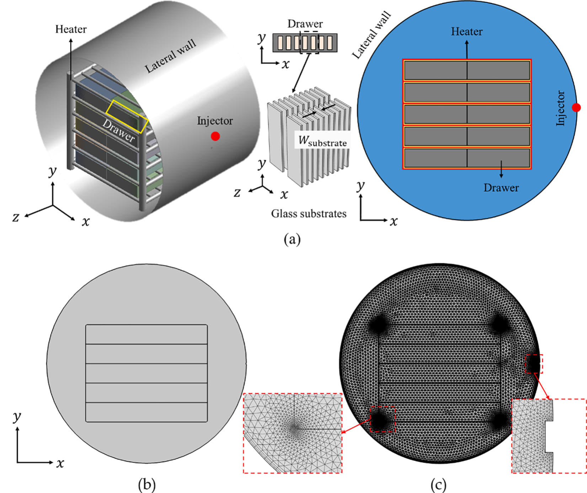

**[2]** **Siyu Zou**, Jinping Zha, Jie Xiao\*, Xiao Dong Chen. How Eyelashes Can Protect the Eye Through Inhibiting Ocular Water Evaporation: A Chemical Engineering Perspective. Journal of the Royal Society Interface, 2019. <https://doi.org/10.1098/rsif.2019.0425>

  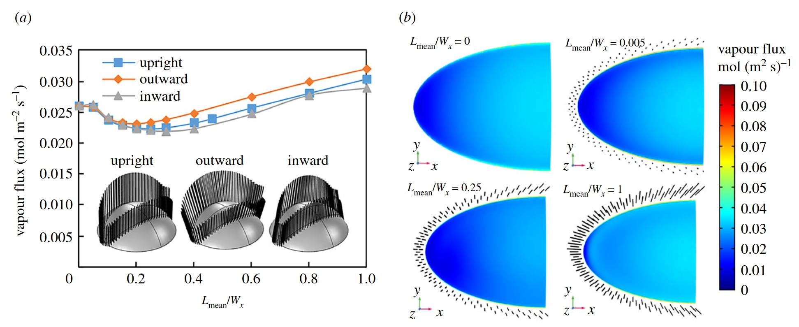

**[1]** **Siyu Zou**, Ersuo Ling, Shurong Le, Shengpeng Sun, Zhangxiong Wu, Xiao Dong Chen, Duo Wu, Jie Xiao\*. Numerical Simulation and Analysis of the Catalytic Ozonation Reactor. Chemical Industry and Engineering Progress, 2019. <https://doi.org/10.16085/j.issn.1000-6613.2018-2476> (In Chinese)

  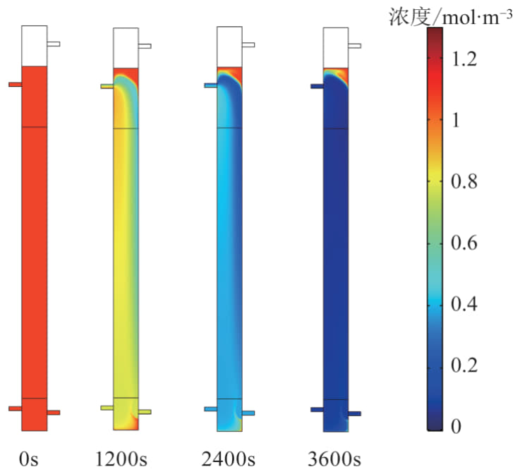

### Other Publications

**[11]** Lihui Huang, **Siyu Zou**, Mengli Zeng, Yaolan Li, Zhiping Liu, Jun Zhang\*, Xinjian Feng\*. Efficient Synthesis of Pyruvic Acid from Biomass Based on Gas-Liquid-Solid Triphase Bioelectrochemical Cascade Reaction. ChemSusChem, 2026. <https://doi.org/10.1002/cssc.202502726>

  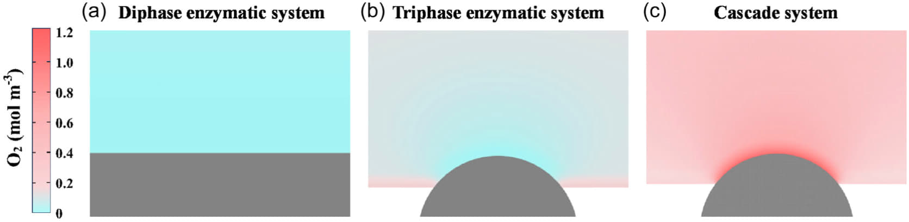

**[10]** Mengli Zeng, **Siyu Zou**, Lihui Huang, Jun Zhang\*, Jiong Wang\*, Xinjian Feng\*. Photothermally Driven Efficient CO₂ Electroreduction Based on a Superhydrophobic Electrode. Journal of the American Chemical Society, 2026.

  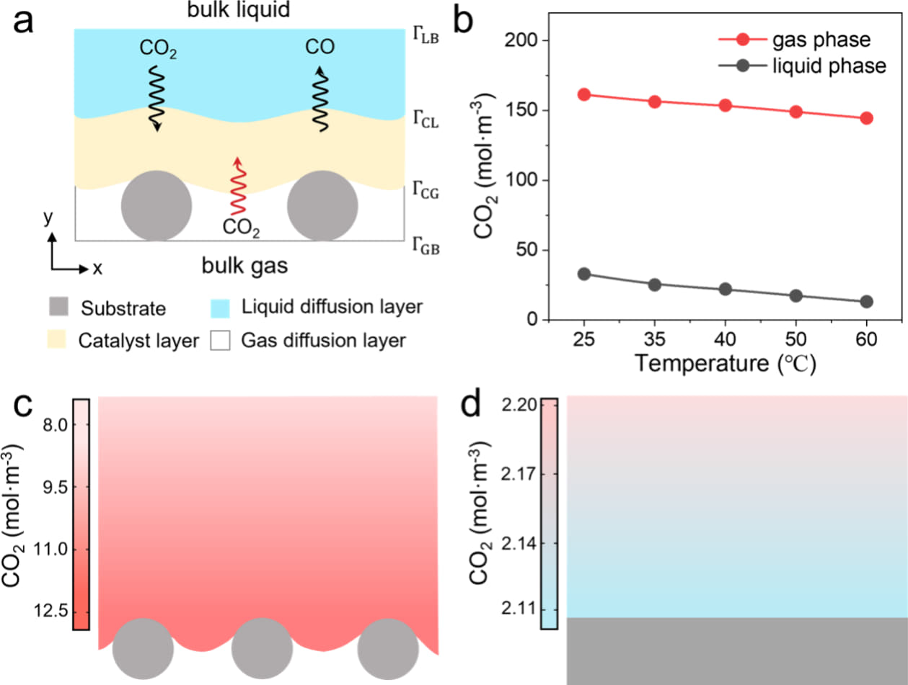

**[9]** Jing Li, **Siyu Zou**, Xinjian Feng\*, Jie Xiao\*. Reaction Intensification in Triphase Enzyme Electrode: In Silico Design of Interfacial Microenvironment. AIChE Journal, 2026. <https://doi.org/10.1002/aic.70210>

  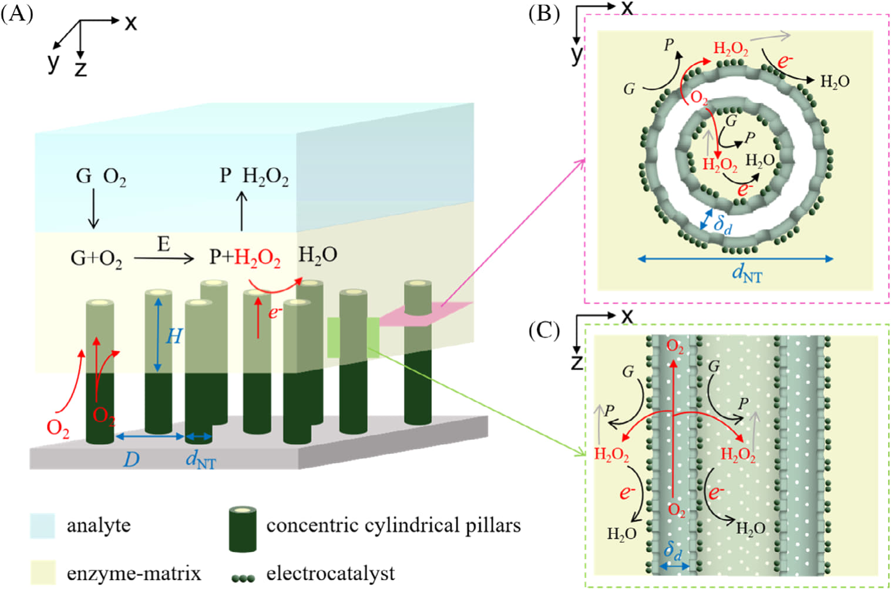

**[8]** Tianmin Wang, **Siyu Zou**, Peng Wu, Renpan Deng, Chaoping Fu, Changyong Li\*, Ai‑Zheng Chen. CFD Modeling of Flow, Mixing, Digestion, and Absorption in the Small Intestine. Food Engineering Reviews, 2025. <https://doi.org/10.1007/s12393-025-09421-w>

  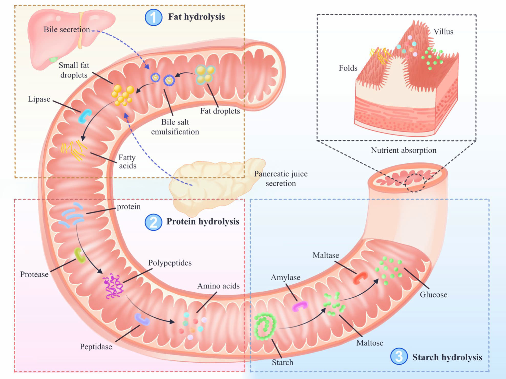

**[7]** Zhiping Liu, **Siyu Zou**, Xi Chen, Lihui Huang, Xia Sheng\*, Xinjian Feng\*. Interfacial Microenvironment and Catalyst Modulation for Efficient Hydrogen Peroxide Synthesis via Mimicking Oxidase Catalysis. Materials Horizons, 2025. <https://doi.org/10.1039/D5MH01332A>

  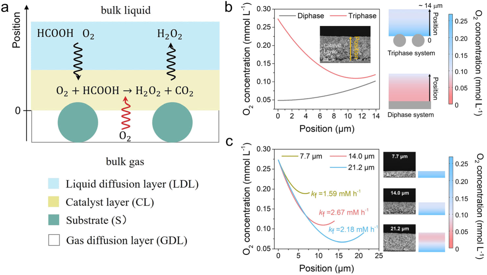

**[6]** Xi Chen, Xia Sheng\*, **Siyu Zou**, Zhiping Liu, Jingyu Lu, Zhaoyue Tan, Xinjian Feng\*. Creation of a Triphasic Reaction Interface to Boost Colloidal Photooxidation under Visible Light. Langmuir, 2025. <https://doi.org/10.1021/acs.langmuir.5c02306>

  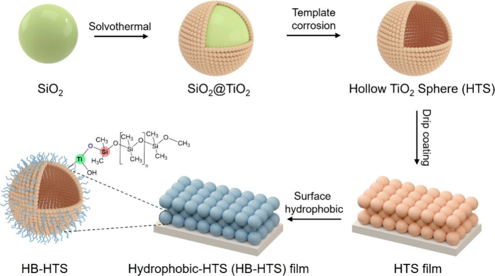

**[5]** Kaixin Li, **Siyu Zou**, Jun Zhang\*, Yang Huang, Lin He\*, Xinjian Feng\*. Superhydrophobicity-Enabled Efficient Electrocatalytic CO₂ Reduction at a High Temperature. ACS Catalysis, 2023. <https://doi.org/10.1021/acscatal.3c01444>

  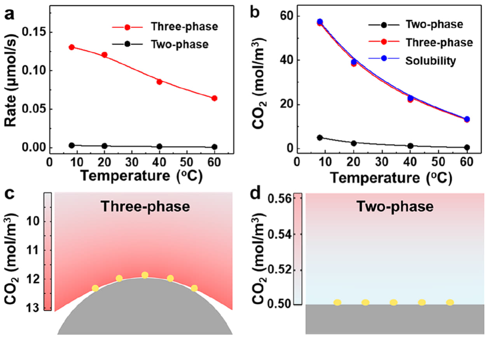

**[4]** Xiao Dong Chen\*, **Siyu Zou**. Reaction Engineering Approach to Turbulence Modelling—Universal Law of the Wall, Pipe Flow, and Planar Jet Flow. Journal of Chemical Engineering of Japan, 2021. <https://doi.org/10.1252/jcej.20we056>

  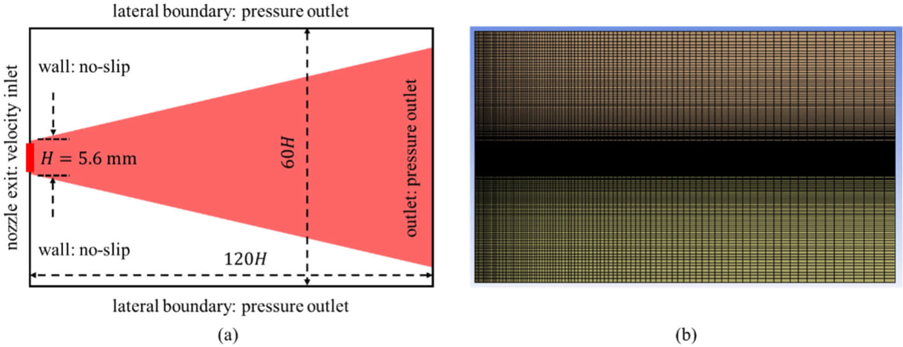

**[3]** Jinping Zha, **Siyu Zou**, Jianyu Hao, Xinjuan Liu, Guillaume Delaplace, Romain Jeantet, Didier Dupont, Peng Wu, Xiao Dong Chen, Jie Xiao\*. The Role of Circular Folds in Mixing Intensification in the Small Intestine: A Numerical Study. Chemical Engineering Science, 2021. <https://doi.org/10.1016/j.ces.2020.116079>

  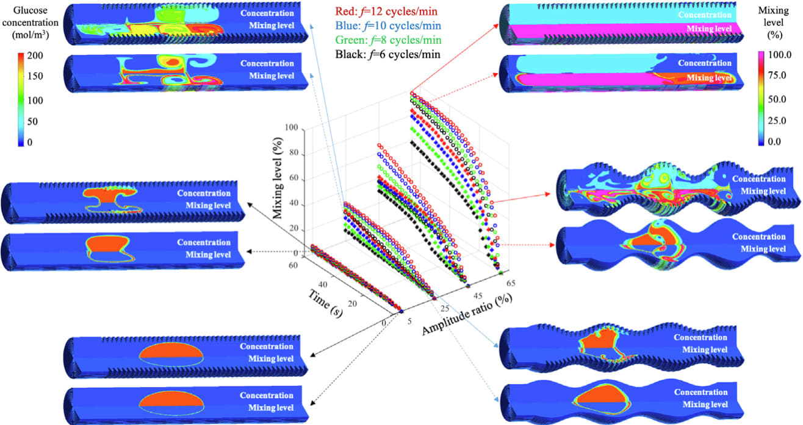

**[2]** Hongtao Xia, **Siyu Zou**, and Jie Xiao\*. Numerical Simulation of Shear-Thinning Droplet Impacting on Randomly Rough Surfaces. CIESC Journal, 2019. <https://doi.org/10.11949/j.issn.0438-1157.20181213> (In Chinese)

  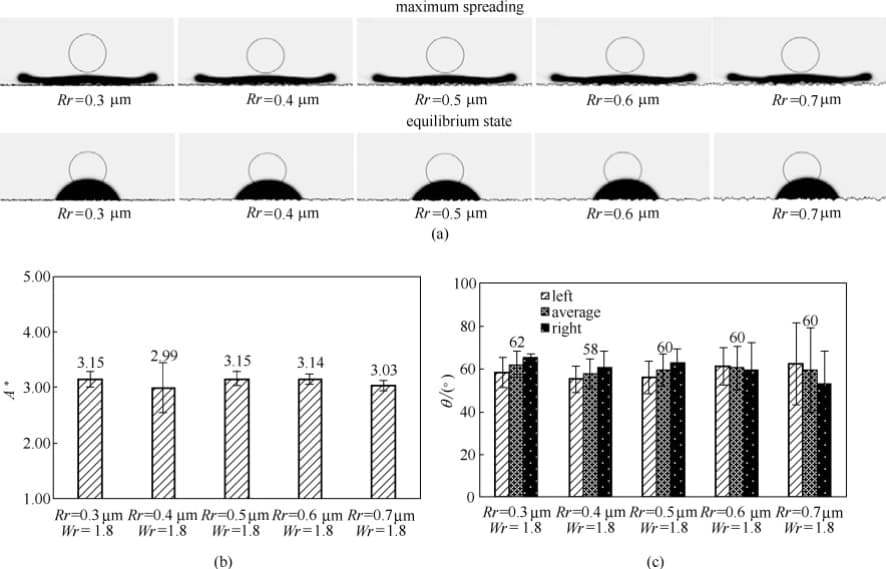

**[1]** Jie Xiao\*, Fei Pan, Hongtao Xia, **Siyu Zou**, Hui Zhang, Oluwafemi Ayodele George, Fei Zhou, Yinlun Huang. Computational Study of Single Droplet Deposition on Randomly Rough Surfaces: Surface Morphological Effect on Droplet Impact Dynamics. Industrial & Engineering Chemistry Research, 2018. <https://doi.org/10.1021/acs.iecr.8b00418>

  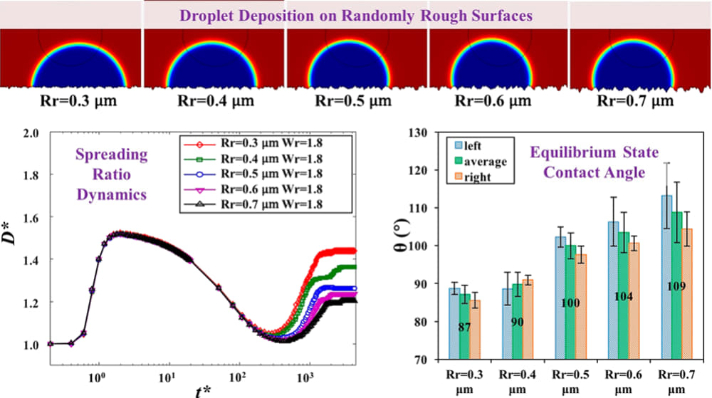

