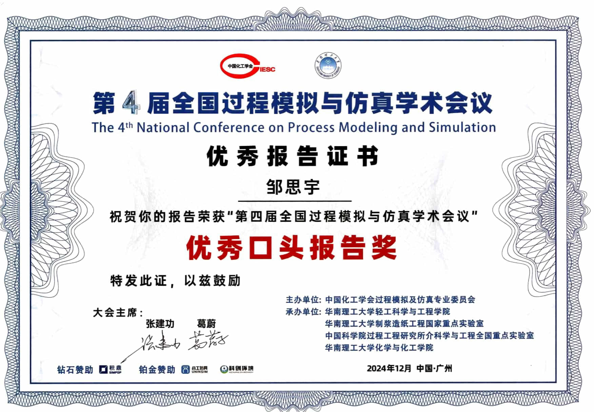

# Siyu Zou (邹思宇)

Siyu Zou (邹思宇) is currently a Lecturer in the School of Chemical Engineering at Xiangtan University.

Address: School of Chemical Engineering, Xiangtan University, Xiangtan, Hunan, China

Email: `siyu [dot] zou [at] xtu [dot] edu [dot] cn` or `zousiyu1995 [at] outlook [dot] com`

Click download my [cv](./cv/cv.pdf).

## Personal Information

I received my Ph.D. degree in Chemical Engineering from [Soochow University](https://chemistry.suda.edu.cn/) (Suzhou, China), under the guidance of Prof. [Xiao Dong Chen](https://scholar.google.com/citations?user=fg3sXKwAAAAJ&hl=zh-CN) and Prof. [Jie Xiao](https://web.suda.edu.cn/jie.xiao/). During My doctoral research, I focused on modeling and simulation of reactors with porous structures.

My main research interests lie in mathematical modeling and numerical simulation of transport phenomena (fluid dynamics, mass and heat transfer, and reaction kinetics) in nature and industry. I leverage chemical engineering principles to develop multi-physics models to understand, design, and optimize these processes. Some examples of application,

- Modeling and design of biosensor, e.g, enzyme electrodes.
- Modeling and optimization of chemical reactors, e.g, fixed bed reactors, CVD reactors.
- Understanding biological systems from chemical engineering perspective, e.g, eyelashes, digestive system, cardiovascular system.

My research methodology typically involved modeling transport phenomena using computational fluid dynamics (CFD) and validating the models through well-defined experiments.

I am also an enthusiastic self-learner with a strong interest in various fields of computer science.

In my spare time, I pursue diverse interests for a healthy work-life balance. I enjoy various music genres like Jazz, Blues, and Chinese folk music. I'm also a fan of strategy board games, particularly the German-style classics like Agricola, Carcassonne, and Castles of Burgundy.

## Employment

- **Since 09/2024, Lecturer**, [School of Chemical Engineering](https://hgxy.xtu.edu.cn/), [Xiangtan University](https://www.xtu.edu.cn/), Xiangtan, Hunan Province, China.
- **07/2021 - 06/2024, Postdoctoral Research Fellow**, [College of Chemistry, Chemical Engineering and Materials Science](https://chemistry.suda.edu.cn/), [Soochow University](https://www.suda.edu.cn/), Jiangsu Province, China. Co-Advisors: Prof. [Xinjian Feng](https://www.researchgate.net/scientific-contributions/Xinjian-Feng-38952909) and Prof. [Jie Xiao](https://web.suda.edu.cn/jie.xiao/). My postdoctoral research focuses on developing a mathematical model for a three-phase enzyme electrode. This project aims to unravel the relationship between electrode performance and the structure of the three-phase interface and reveal the underlying mechanisms.

## Skills

- **Expertise**: Chemical Engineering, Transport Phenomena, Fluid Mechanics, Mass Transfer, Heat Transfer, Reaction Engineering, Reacting Flows, Porous Media, Incompressible Flows, Process Modeling and Simulation, Mathematical Modeling, Numerical Simulation
- **Modeling & Simulation**: Physics-Based Modeling, Continuum Modeling, Multi-Physics Modeling, Multi-Scale Modeling, Machine Learning, Deep Learning, Differential Equation, Finite Element Method (FEM), Computational Fluid Dynamics (CFD), Turbulence Modeling, Moving Mesh
- **Software**: ANSYS Fluent, COMSOL Multiphysics, MATLAB, LaTeX, Pandas, Numpy, Matplotlib, Linux, Blender
- **Programming**: MATLAB, Python, C, Algorithms, Data Structures
- **Languages**: Chinese (native speaker), English (intermediate)

## Honours and Awards

- **01/12/2024, Best Oral Presentation Award**:  In the 4th National Conference on Process Modeling and Simulation (hosted by South China University of Technology), my talk "Mathematical Modeling of Three-Phase Interface Enzyme Electrode" was honored with the Best Oral Presentation Award. This work has been published in [AIChE Journal](https://doi.org/10.1002/aic.18420) and [Industrial & Engineering Chemistry Research](https://doi.org/10.1021/acs.iecr.2c04492).

  

- **07/2022, Jiangsu Funding Program for Excellent Postdoctoral Talent**: This funding is provided by the Jiangsu provincial government.
- **07/2020, Best Student Oral Presentation Award**: In the 2nd National Conference on Process Modeling and Simulation, my talk on eyelashes ("Inhibition of Ocular Water Evaporation by Eyelashes: Computer Simulation and Mechanism Analysis") was awarded the Best Student Presentation Award (1 of 12 awardees out of 62 student talks). This work has been published in [Journal of the Royal Society Interface](https://royalsocietypublishing.org/doi/10.1098/rsif.2019.0425). This conference was organized by the [Simulation & Virtual Process Engineering Committee](http://www.ciesc.cn/branch/226), one of the professional committees of the [Chemical Industry and Engineering Society of China (CIESC)](http://www.ciesc.cn/).

  

## Publications

Also find me on [Google Scholar](https://scholar.google.com/citations?user=w6AliuwAAAAJ&hl=zh-CN) and [Research Gate](https://www.researchgate.net/profile/Siyu-Zou-3).

### Main Publications

**[7]** **Siyu Zou**, Jie Xiao\*, and Xinjian Feng\*. "Engineering a Three-Dimensional Three-Phase Interface for Enhanced Enzymatic and Electrochemical Cascade Reactions". (In preparation)

**[6]** **Siyu Zou**, Jie Xiao\*, Xiao Dong Chen\*. A Comprehensive Comparison of Different RANS Turbulence Models in Modeling Turbulent Plane Jets. (In preparation)

**[5]** **Siyu Zou**, Jie Xiao\*, Xinjian Feng\*. Modeling Enzymatic and Electrochemical Cascade Reactions at the Three-Phase Interface Enzyme Electrode. AIChE Journal, 2024, 70 (6), e18420. <https://doi.org/10.1002/aic.18420>.

  

**[4]** **Siyu Zou**, Dandan Wang, Jie Xiao\*, Xinjian Feng\*. Mathematical Model for a Three-Phase Enzymatic Reaction System. Industrial & Engineering Chemistry Research, 2023, 62 (10), 4337–4343. <https://doi.org/10.1021/acs.iecr.2c04492>.

  

**[3]** **Siyu Zou**, Jie Xiao\*, Viola Wu, Xiao Dong Chen\*. Analyzing Industrial CVD Reactors Using a Porous Media Approach. Chemical Engineering Journal, 2021, 415, 129038. <https://doi.org/10.1016/j.cej.2021.129038>.

  

**[2]** **Siyu Zou**, Jinping Zha, Jie Xiao\*, Xiao Dong Chen. How Eyelashes Can Protect the Eye Through Inhibiting Ocular Water Evaporation: A Chemical Engineering Perspective. Journal of the Royal Society Interface, 2019, 16 (159), 20190425. <https://doi.org/10.1098/rsif.2019.0425>.

  

**[1]** **Siyu Zou**, Ersuo Ling, Shurong Le, Shengpeng Sun, Zhangxiong Wu, Xiao Dong Chen, Duo Wu, and Jie Xiao\*. "Numerical Simulation and Analysis of the Catalytic Ozonation Reactor". Chemical Industry and Engineering Progress, 2019, 38, 3969–3978. <https://doi.org/10.16085/j.issn.1000-6613.2018-2476> (In Chinese)

### Other Publications

**[5]** Kaixin Li, **Siyu Zou**, Jun Zhang\*, Yang Huang, Lin He\*, and Xinjian Feng\*. Superhydrophobicity-Enabled Efficient Electrocatalytic CO₂ Reduction at a High Temperature. ACS Catalysis, 2023, 13 (14), 9346–9351. <https://doi.org/10.1021/acscatal.3c01444>.

  

**[4]** Xiao Dong Chen\*, **Siyu Zou**. Reaction Engineering Approach to Turbulence Modelling—Universal Law of the Wall, Pipe Flow, and Planar Jet Flow. Journal of Chemical Engineering of Japan, 2021, 54 (1), 1–11. <https://doi.org/10.1252/jcej.20we056>.

**[3]** Jinping Zha, **Siyu Zou**, Jianyu Hao, Xinjuan Liu, Guillaume Delaplace, Romain Jeantet, Didier Dupont, Peng Wu, Xiao Dong Chen, Jie Xiao\*. The Role of Circular Folds in Mixing Intensification in the Small Intestine: A Numerical Study. Chemical Engineering Science, 2021, 229, 116079. <https://doi.org/10.1016/j.ces.2020.116079>.

  

**[2]** Hongtao Xia, **Siyu Zou**, and Jie Xiao\*. "Numerical Simulation of Shear-Thinning Droplet Impacting on Randomly Rough Surfaces". CIESC Journal, 2019, 70, 634–645. <https://doi.org/10.11949/j.issn.0438-1157.20181213> (In Chinese)

**[1]** Jie Xiao\*, Fei Pan, Hongtao Xia, **Siyu Zou**, Hui Zhang, Oluwafemi Ayodele George, Fei Zhou, Yinlun Huang. Computational Study of Single Droplet Deposition on Randomly Rough Surfaces: Surface Morphological Effect on Droplet Impact Dynamics. Industrial & Engineering Chemistry Research, 2018, 57 (22), 7664–7675. <https://doi.org/10.1021/acs.iecr.8b00418>.

  

## Conference Presentations

- **29/11 - 01/12/2024**, Contributed Talk, Mathematical Modeling of Three-Phase Interface Enzyme Electrode, The 4th National Conference on Process Modeling and Simulation, Guangzhou, China.
- **16/07 - 17/07/2020**, Contributed Talk, The Inhibitory Effect of Eyelashes on Water Evaporation on Ocular Surface: Computer Simulation and Mechanism Analysis, The 2nd National Conference on Process Modeling and Simulation, Online, China.
- **25/08 - 27/08/2018**, Poster, Multiscale Numerical Simulation of the Catalytic Ozonation Reactor for Wastewater Treatment, The 1st National Conference on Process Modeling and Simulation, Shanghai, China.
